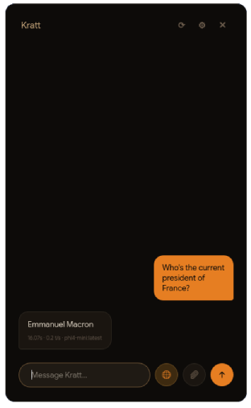

# Kratt
A lightweight, local-first desktop AI assistant powered by Ollama.



---

## Getting Started

### Prerequisites

Before you begin, ensure you have the following installed and running:

1.  **Python**: Version 3.10 or newer.
2.  **Ollama**: Download and install from [ollama.com](https://ollama.com/).
3.  **LLMs**: Pull at least one general-purpose model and one vision model.
    ```sh
    # Example models
    ollama pull phi3:mini
    ollama pull moondream
    ```

### Installation & Running

1.  **Clone the repository:**
    ```sh
    git clone https://github.com/your-username/kratt.git
    cd kratt
    ```

2.  **Install the required Python packages:**
    It is recommended to use a virtual environment.
    ```sh
    python -m venv .venv
    source .venv/bin/activate
    pip install -r requirements.txt
    ```

3.  **Run the application:**
    ```sh
    python -m kratt.main
    ```

---

## Configuration

Kratt is configurable through its built-in settings dialog, which can be accessed by clicking the gear icon (⚙️) in the header.

*   **Models**: The application automatically detects and lists all models available in your local Ollama instance. You can select different models for text and vision tasks.
*   **System Prompt**: You can edit the system prompt to customize the assistant's personality, behavior, and response format.

The default hotkey is set in `kratt/config.py` and can be modified there if needed.

## License

Distributed under the MIT License. See `LICENSE` for more information.